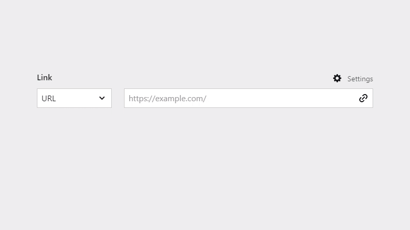
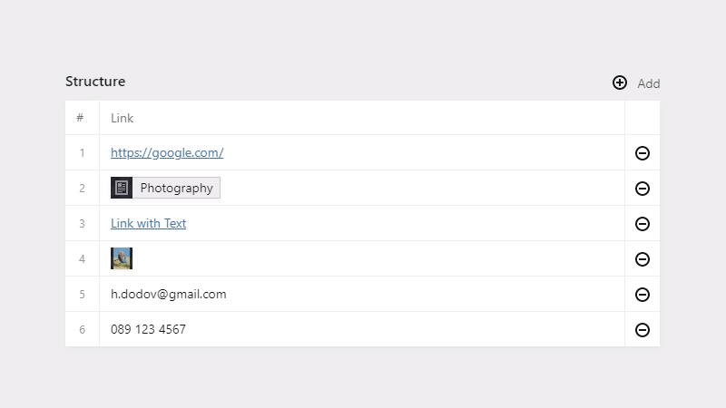

# kirby-link-field

Kirby 3 Field for links of any kind - external, page, file, email, phone. Has settings for text, popup true/false, and hash. Original plugin is [this](https://github.com/medienbaecker/kirby-link-field), created by [Thomas Günther](https://github.com/medienbaecker).

The plugin uses the native Kirby fields for pages, files, url, email, and tel:



If used inside a structure field, link fields get a nice preview. Links to pages and files get the native page/file preview:



## Installation

With [Composer](https://packagist.org/packages/oblik/kirby-link-field):

```
composer require oblik/kirby-link-field
```

...or check out [other plugin installation methods](https://getkirby.com/docs/guide/plugins/plugin-setup-basic#the-three-plugin-installation-methods).

## Blueprint

Add a field and set its type to `link`:

```yaml
fields:
  myfield:
    type: link
    label: Link
```

To define what link types you want, use `options`. Possible values are `url`, `page`, `file`, `email`, and `tel`:

```yaml
fields:
  myfield:
    type: link
    label: Link
    options:
      - page
      - url
```

By default, you can also specify link text, popup true/false, and hash. You can disable those options or change their appearance by using the `settings` value:

```yaml
fields:
  myfield:
    type: link
    label: Link
    settings:
      popup:
        width: 1/3
        label: External Link
        help: Open link in a new tab?
      text:
        width: 2/3
      hash: false
```

To disable settings altogether, set:

```yaml
settings: false
```

You could also apply such settings globally:

*config/config.php*

```php
return [
    'oblik.linkField' => [
        'options' => [
            'url',
            'page'
        ],
        'settings' => [
            'popup' => [
                'label' => 'External Link'
            ]
        ]
    ]
];
```

...or:

```php
return [
    'oblik.linkField.settings' => false
];
```

## Usage

To render the links, use the provided `toLinkObject()` method. It returns an instance of the Link class.

Let's say you have a field with the following values:

```
Myfield: 

type: page
value: home
text: My Text
popup: true
hash: heading-1
```

```php
$link = $page->myfield()->toLinkObject();
```

### `$link->url()`

Returns the link URL, including the hash:

```
http://localhost/home#heading-1
```

**Note:** For `email` and `tel` links, the value is `null` since they're not actual links.

### `$link->href()`

Returns link href:

```
http://localhost/home#heading-1
```

If the link type is `email` or `tel`, it has `mailto:` or `tel:` accordingly.

**Note:** This is automatically called when you try to convert the class to string, meaning that:

```php
echo $page->myfield()->toLinkObject();
```

...is the same as:

```php
echo $page->myfield()->toLinkObject()->href();
```

### `$link->attr([$attributes])`

Returns the link attributes, merged with the optional `$attributes`:

```
href="http://localhost/home#heading-1" rel="noopener noreferrer" target="_blank"
```

### `$link->tag([$attributes])`

Returns a full `<a>` tag with merged attributes from the optional `$attributes`:

```html
<a href="http://localhost/home#heading-1" rel="noopener noreferrer" target="_blank">My Text</a>
```

### `$link->title()`

Returns either the link text, page title, file title, filename, or finally the value. Used to generate the link text for the `tag()` method.

### Retrieving Properties

You can get the properties of a link by invoking them as a method:

```php
echo $link->type();     // page
echo $link->value();    // home
echo $link->text();     // My Text
echo $link->popup();    // true
echo $link->hash();     // heading-1
```

## Migrating From URL Fields

If you've previously used a URL field:

```yml
fields:
  myfield:
    type: url
```

...you could simply change it to:

```yml
fields:
  myfield:
    type: link
```

...and it'll work. Also, the `toLinkObject()` method can handle both link formats in your TXT files. It's the same if you have:

```
Myfield: https://example.com
```

...or:

```
Myfield:

type: url
value: https://example.com
```
